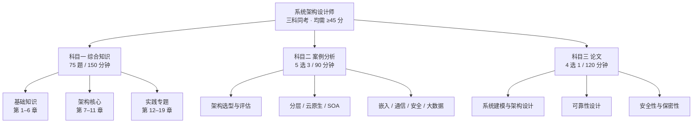
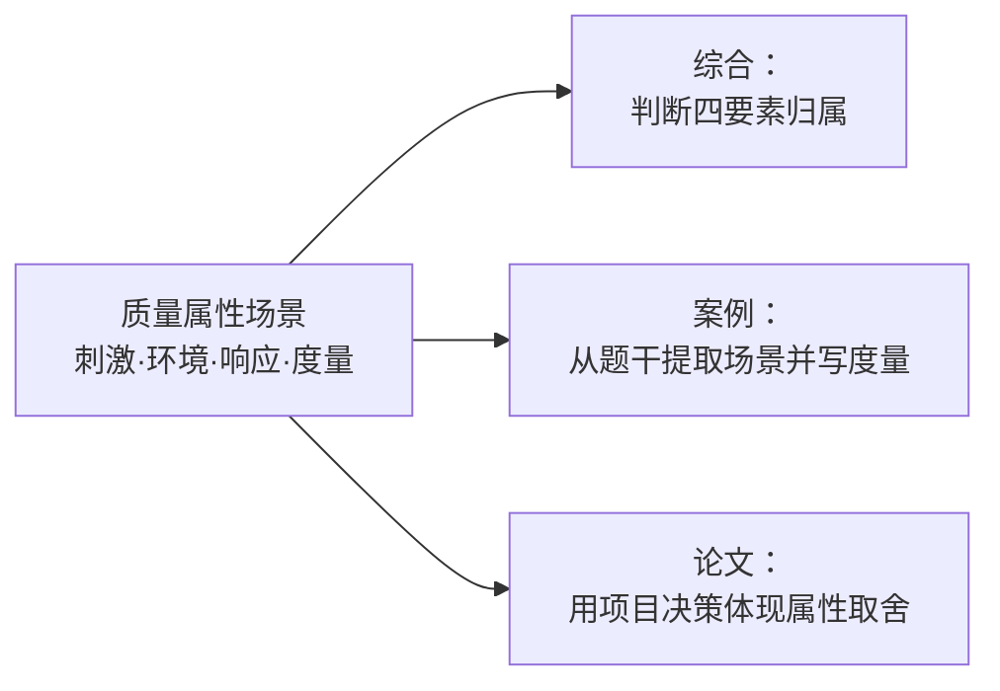

# 总体知识思维导图

一页看清三科考什么、知识怎么串联。**建议先读这里建立框架，再进知识点阅读器逐章深入。**

## 三科结构

## 综合知识：13 个考试知识域

| 知识域 | 教材对应 | 高频要点 |
|---|---|---|
| 计算机系统 | 第 2 章 | 进程管理、存储管理、RAID、流水线、性能计算 |
| 信息系统 | 第 3 章 | TPS/MIS/DSS/ERP、EAI、物联网分层、数字孪生 |
| 信息安全 | 第 4 章 | 加密体制、密钥管理、访问控制、等级保护 |
| 软件工程 | 第 5 章 | 开发模型、需求工程、UML、测试、净室、CMMI |
| 数据库 | 第 6 章 | 三级模式、范式、反规范化、事务与锁、NoSQL |
| **系统架构设计** | 第 7 章 | 架构风格、ABSD、ABD 生命周期、DSSA、ADL |
| **质量属性与评估** | 第 8 章 | 场景四要素、敏感点/权衡点、ATAM 四阶段 |
| 软件可靠性 | 第 9 章 | MTTF/MTTR/可用度、容错与检错、运行剖面 |
| 架构演化维护 | 第 10 章 | 静态/动态演化、演化原则、网站演进路径 |
| 未来信息技术 | 第 11 章 | CPS、AI、机器人、边缘计算、数字孪生 |
| 标准化与知识产权 | 无独立章 | 标准分级、专利/著作权保护期 |
| 应用数学 | 无独立章 | 线性规划、概率统计、图论 |
| 专业英语 | 无独立章 | 阅读理解 + 术语填空（第 71–75 题） |

## 案例分析：9 大主题

| 主题 | 教材对应 | 答题落点 |
|---|---|---|
| 系统计划 | 第 12 章 | 可行性分析、新旧系统比较、资源利用 |
| 信息系统架构 | 第 12 章 | TOGAF/ADM、信息化总体架构 |
| 层次式架构 | 第 13 章 | 表现/中间/数据访问层职责与边界 |
| 云原生架构 | 第 14 章 | 容器、微服务、服务网格、反模式识别 |
| SOA | 第 15 章 | 服务识别、ESB、微服务对比 |
| 嵌入式架构 | 第 16 章 | 实时性、资源约束、安全攸关 |
| 通信系统架构 | 第 17 章 | 高可用、IPv4/IPv6 双栈、SDN |
| 安全架构 | 第 18 章 | 威胁建模、纵深防御、WPDRRC |
| 大数据架构 | 第 19 章 | Lambda vs Kappa、选型权衡 |

## 论文：常考方向

| 方向 | 可写内容 |
|---|---|
| 系统建模 | 建模方法选择、模型驱动、架构描述语言 |
| 软件架构设计 | 架构风格选型、质量属性驱动、架构评估 |
| 系统设计 | 高并发、高可用、可扩展设计 |
| 可靠性 | 容错设计、故障隔离、容灾 |
| 安全性与保密性 | 安全体系、身份认证、数据保护 |

## 跨科联系

同一个知识点在三科中的考法不同，**用同一份理解应对三科**：

再比如「架构风格」：

- **综合**：辨别某系统属于哪种风格；
- **案例**：说明为什么选它、代价是什么；
- **论文**：写自己项目里的选型决策与效果。

## 复习优先级建议

按「考频 × 提分速度」排序：

1. **质量属性与 ATAM**（第 8 章）——三科通用，模型清晰，性价比最高
2. **架构风格**（第 7.3 节）——选择题必考，案例常考
3. **云原生 / 微服务**（第 14 章）——近年新增考点密集
4. **数据库**（第 6 章）——范式、反规范化、事务是稳分项
5. **信息安全**（第 4、18 章）——概念多但套路固定
6. **大数据架构**（第 19 章）——Lambda/Kappa 对比易出案例题

## 如何使用本图

- **第 1 周**：通读一遍，能说出三科各考什么。
- **每周日**：对照本图，标记本周覆盖了哪些块，发现长期空白的块。
- **考前 2 周**：只看本图做回忆，想不起细节的再回知识点阅读器。

> 本图为知识库原创框架，用于建立复习结构；具体定义、机制与公式请以
> 知识点阅读器中的教材原文和官方大纲为准。
